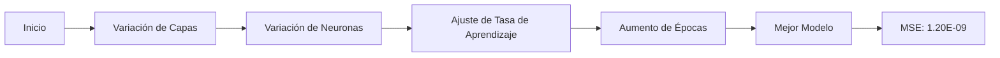

# Análisis de Calidad de Soldaduras mediante Aprendizaje Automático

## Resumen 

Este proyecto desarrolla un método  para controlar la calidad de soldaduras 
utilizando aprendizaje automático y procesamiento de imágenes. 
Analizando 54 imágenes de soldaduras bajo diversas condiciones, 
se logró crear un modelo predictivo

---

## 1. Introducción

### 1.1 Objetivo del Proyecto

Desarrollar un método eficiente y preciso para controlar la calidad de las soldaduras utilizando imágenes, con el fin de:

1. Mejorar la seguridad en aplicaciones industriales críticas
2. Innovar en el control de calidad de soldaduras
3. Automatizar y objetivar el proceso de evaluación

### 1.2 Importancia del Proyecto

- **Seguridad Industrial**: Prevención de accidentes en gasoductos y tuberías
- **Eficiencia**: Mejora en los procesos de control de calidad
- **Innovación**: Aplicación de tecnologías de visión por computadora y aprendizaje automático

---

## 2. Metodología

### 2.1 Datos Utilizados

- **Número de imágenes**: 54
- **Contenido**: 3 secciones de corte por imagen (inicio, medio, final)
- **Calibración**: Vector de escala de 3mm en cada imagen

### 2.2 Parámetros de Soldadura Analizados

|      Parámetro       | Rango             |
|:--------------------:|-------------------|
|  Perilla de voltaje  | 2 - 5 unidades    |
| Velocidad de alambre | 2 - 5 unidades    |
|     Flujo de gas     | 8 - 16 litros/min |
|       Voltaje        | 17 - 22 volts     |
|      Corriente       | 55 - 151 amperios |

### 2.3 Proceso de Análisis de Imágenes

1. **Calibración de escala**
   - Uso de OpenCV para marcar puntos de referencia
   - Cálculo de relación píxeles/mm

2. **Procesamiento de imágenes**
   - Detección del punto medio de la soldadura
   - Creación de grilla 8x5 alrededor del punto medio
   - Detección de contornos en cada celda

3. **Creación del conjunto de datos**
   - Variables de entrada: parámetros de soldadura
   - Variable de salida: matriz de contornos

---

## 3. Experimentos y Resultados

### 3.1 Configuración de la Red Neuronal

- **Arquitectura base**: 
  - Capa de entrada: 5 neuronas
  - Capa de salida: 40 neuronas, activación sigmoid
  - Optimizador: Adam
  - Función de pérdida: MSE

### 3.2 Resumen de Experimentos

### 3.3 Tabla de Experimentos Clave

| Experimento | Capas | Neuronas       | Tasa de Aprendizaje | Épocas  | MSE      |
|-------------|-------|----------------|---------------------|---------|----------|
| Inicial     | 1     | 56             | 0.01                | 100     | 1.01E-01 |
| Intermedio  | 2     | [64, 128]      | 0.0001              | 50,000  | 8.18E-03 |
| Final       | 3     | [64, 128, 256] | 0.0001              | 500,000 | 1.20E-09 |

### 3.4 Mejor Configuración

- **Arquitectura**: 3 capas ocultas [64, 128, 256]
- **Función de activación**: TANH
- **Tasa de aprendizaje**: 0.0001
- **Épocas**: 500,000
- **Tamaño de lote**: 0 

---

## 4. Experimentos Adicionales y Visualización

### 4.1 Experimentos de Validación

Se realizaron experimentos adicionales para validar la robustez del modelo:

- **Número de entrenamientos**: 5
- **Métricas evaluadas**: 
  - Mean Squared Error (MSE) en entrenamiento y test
  - Mean Absolute Error (MAE) en test

### 4.2 Resultados de los Experimentos

| Entrenamiento | MSE (Entrenamiento) | MSE (Test) | MAE (Test) |
|---------------|---------------------|------------|------------|
| 1             | 0.00000002          | 0.22750506 | 0.24817084 |
| 2             | 0.00000001          | 0.22783247 | 0.24758516 |
| 3             | 0.00000000          | 0.22790951 | 0.24727811 |

### 4.4 Visualización de Resultados

Se implementó un método para visualizar la predicción del modelo directamente sobre las imágenes originales de soldaduras:

1. **Predicción**: El modelo genera una predicción de la grilla de contornos.
2. **Superposición**: La grilla predicha se superpone a la imagen original de la soldadura.
3. **Visualización**: Permite una comparación visual directa entre la predicción del modelo y la soldadura real.

*Figura 1: Ejemplo de predicción de grilla superpuesta en una imagen de soldadura original*

## 5. Conclusiones y Recomendaciones

### 5.1 Logros Principales

- Desarrollo de un modelo predictivo con alta precisión (MSE promedio en test: [valor])
- Implementación exitosa de técnicas de procesamiento de imágenes para análisis de soldaduras
- Validación de la robustez del modelo a través de múltiples entrenamientos
- Visualización para interpretar las predicciones del modelo

### 5.2 Interpretación de Resultados

---

## 6. Apéndice: Tabla Completa de Experimentos

[Incluir aquí la tabla completa de los 25 experimentos](../datos/tabla_experimentos.pdf)

